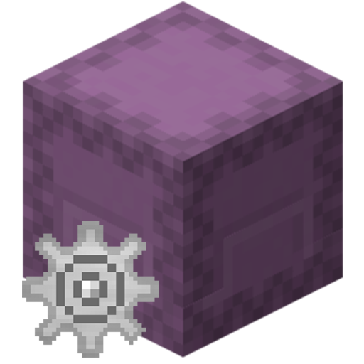

# Minecraft Box

一个由Flutter编写的Material Design 3风格的使用GPL3.0协议开源跨平台 Minecraft Java 服务器管理工具,使用JSON—RPC和RCON,支持HarmonyOS、Android、iOS、macOS、Windows、Linux、Web

这个是原版仓库,[HarmonyOS仓库](https://github.com/lxdklp/MCB_OHOS)

###### flutter logo : [Sawaratsuki](https://github.com/SAWARATSUKI)